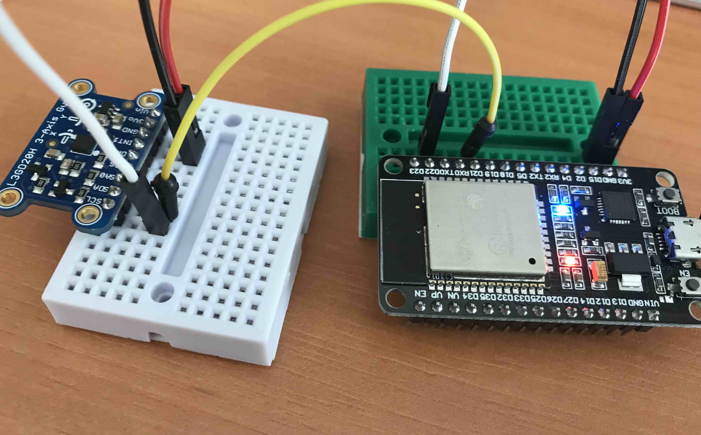

# L3GD20H - ESP-IDF I2C

A small library to manage Adafruit L3GD20H 3D Gyroscope for ESP-IDF, tested on ESP32 Dev Kit.

https://www.adafruit.com/product/1032

## Wiring

- L3GD20H SCL -> ESP32 D22
- L3GD20H SDA -> ESP32 D21



## ESp-IDF I2C

ESP-IDf I2C is initialized using  i2c_master_init function:
```C

static esp_err_t i2c_master_init()
{
    int i2c_master_port = 0;
    i2c_config_t conf;
    conf.mode = I2C_MODE_MASTER;
    conf.sda_io_num = I2C_MASTER_SDA_IO;
    conf.sda_pullup_en = GPIO_PULLUP_ENABLE;
    conf.scl_io_num = I2C_MASTER_SCL_IO;
    conf.scl_pullup_en = GPIO_PULLUP_ENABLE;
    conf.master.clk_speed = I2C_MASTER_FREQ_HZ;
    i2c_param_config(i2c_master_port, &conf);
    return i2c_driver_install(i2c_master_port, conf.mode,
                              I2C_MASTER_RX_BUF_DISABLE,
                              I2C_MASTER_TX_BUF_DISABLE, 0);
}

```

I2C Data is sent i2c_master_write_slave:

```C

static esp_err_t i2c_master_write_slave(i2c_port_t i2c_num, uint8_t *data_wr, size_t size)
{
    i2c_cmd_handle_t cmd = i2c_cmd_link_create();
    i2c_master_start(cmd);
    i2c_master_write_byte(cmd, (L3GD20_ADDRESS << 1) | WRITE_BIT, ACK_CHECK_EN);
    i2c_master_write(cmd, data_wr, size, ACK_CHECK_EN);
    i2c_master_stop(cmd);
    esp_err_t ret = i2c_master_cmd_begin(i2c_num, cmd, 1000 / portTICK_RATE_MS);
    i2c_cmd_link_delete(cmd);
    return ret;
}

```

I2C Data is read via i2c_master_read_slave:


```C

static esp_err_t i2c_master_read_slave(i2c_port_t i2c_num, uint8_t *data_rd, size_t size)
{
    if (size == 0)
    {
        return ESP_OK;
    }
    i2c_cmd_handle_t cmd = i2c_cmd_link_create();
    i2c_master_start(cmd);
    i2c_master_write_byte(cmd, (L3GD20_ADDRESS << 1) | READ_BIT, ACK_CHECK_EN);
    if (size > 1)
    {
        i2c_master_read(cmd, data_rd, size - 1, ACK_VAL);
    }
    i2c_master_read_byte(cmd, data_rd + size - 1, NACK_VAL);
    i2c_master_stop(cmd);
    esp_err_t ret = i2c_master_cmd_begin(i2c_num, cmd, 1000 / portTICK_RATE_MS);
    i2c_cmd_link_delete(cmd);
    return ret;
}

``